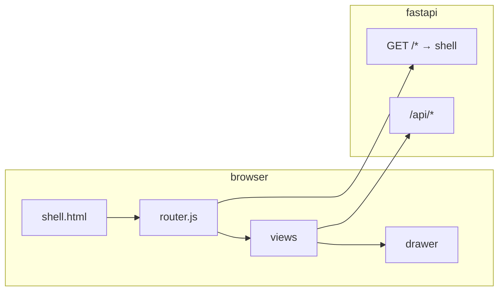

# Fund Web SPA Shell — Design Spec

**Date:** 2026-05-26  
**Status:** Approved (brainstorming)  
**Approach:** JSON-driven single-page application (方案 2)

## Goal

Replace multi-page Jinja navigation (horizontal link bar, full page reloads) with one shell: fixed left sidebar, client-rendered modules, right drawer for industry/fund drill-down. Primary user workflow is **market/industry overview first**, then occasional detail peeks.

## User decisions (locked)

| Topic | Choice |
|-------|--------|
| Primary workflow | Market/industry overview (仪表盘 → 行业/基金) |
| Detail UX | Right slide-over drawer |
| Scope | All six areas in one shell (incl. crawler) |
| Navigation | Fixed left sidebar (~220px) |
| Implementation | JSON-driven SPA (not HTML fragment swap) |
| Routing | History API paths under `FUND_URL_PREFIX` |
| Phasing | Three phases (see below) |

## Information architecture

### Sidebar order (top → bottom)

1. **行业仪表盘** — default route `/`
2. **行业资金流向** — `/sectors`
3. **宽基 PE** — `/valuation`
4. **基金目录** — `/funds`
5. **基金 AI 助手** — `/advisor`
6. **爬虫任务** — `/crawler` (visually de-emphasized: muted label, bottom of nav)

### Layout

```
┌──────────────┬────────────────────────────────────────────┐
│ Logo / title │  Module toolbar (filters, actions)         │
│──────────────│────────────────────────────────────────────│
│ Nav item ×6  │  Main content (view-specific tables/cards) │
│              │                                            │
│ Sync hint    │                                            │
└──────────────┴────────────────────────────────────────────┘
                              ┌──────────────────────────────┐
                              │ Drawer: sector | fund        │
                              │ [×] title                    │
                              │ body (lazy-loaded JSON)      │
                              └──────────────────────────────┘
```

- Drawer: ~40–50% width desktop; full-width overlay on narrow viewports.
- Close: × button, Esc, click backdrop.
- Opening drawer does not change sidebar selection (user stays on dashboard/sectors/etc.).

### URL contract

Base: `FUND_URL_PREFIX` (e.g. `/quant-funds`). All paths relative to prefix.

| Path | Module | Notes |
|------|--------|-------|
| `/` | Dashboard | |
| `/sectors` | Sector fund flow table | |
| `/valuation` | Index + industry PE | |
| `/funds` | Fund catalog | |
| `/advisor` | AI advisor | |
| `/crawler` | Crawler ops | |

**Drawer query params** (optional, shareable):

- `?drawer=sector&industry=<name>&period=<p>&trade_date=<d>`
- `?drawer=fund&code=<6-digit>`

**Legacy redirects** (301/302):

| Old | New |
|-----|-----|
| `/sectors/{industry}` | `/?drawer=sector&industry=…` or `/sectors?drawer=sector&industry=…` |
| `/funds/{code}` | `/funds?drawer=fund&code=…` |
| `/advisor`, `/crawler`, `/valuation` | Same path under shell |

Exclude from shell catch-all: `/api/*`, `/health`, static assets.

## Architecture



### Backend

- **Thin JSON routes** in `quant_trading/funds/app.py`; business logic stays in `fund_platform/*_queries.py`.
- **Single HTML response** for app shell; inject boot config:

```json
{
  "base": "/quant-funds",
  "apiBase": "/quant-funds/api"
}
```

- Existing `/api/*` endpoints remain; add only gaps listed below.

### Frontend

- **Vanilla ES modules** under `src/quant_trading/funds/static/fund-app/` (no React/Vite in v1).
- No build step required for deploy (optional minify later).
- Shared `theme.css`: CSS variables from `_fund_theme.html` (涨红跌绿, panels, tables).
- `api.js`: `fetch`, JSON errors, loading state helpers.
- In-memory cache per view key (`module + query hash`); invalidate on manual refresh control if added.

## API surface

### Already sufficient (reuse)

| Endpoint | Use |
|----------|-----|
| `GET /api/dashboard` | Dashboard body |
| `GET /api/sector-fund-flow` | Sectors table |
| `GET /api/sectors/{industry}/constituents` | Drawer constituents (partial) |
| `GET /api/valuation/indices` (+ `/history`) | Valuation |
| `GET /api/valuation/industry` (+ `/history`) | Industry PE on valuation page |
| `GET /api/funds` | Catalog pagination |
| `GET /api/funds/{code}` (+ nav-history, peer-*) | Fund drawer |
| `GET /api/crawler/tasks`, `/api/crawler/runs` | Crawler |
| `GET /api/advisor/prompt`, `POST /api/advisor/parse` | Advisor |
| `GET /api/sync/status` | Header sync summary |

### New or extended (required)

| Endpoint | Purpose |
|----------|---------|
| `GET /api/meta/flow` | `period_options`, `date_options` (last 30 trade dates), optional `default_period` |
| `GET /api/dashboard` (extend) OR meta | `industry_options`, `has_exposure`, `exposure_report_date` in one round-trip |
| `GET /api/sectors/{industry}` | `summary`, `constituents`, `data_source`, `lookup_date`, `fetch_error` — mirrors current `sector_detail_page` server logic |
| `GET /api/meta/funds` | Filter enums: `fund_types`, categories if needed by catalog |
| `GET /api/advisor/options` | `tag_options` (today only in Jinja) |
| `GET /api/meta/app` (optional) | Combine small meta blobs for shell boot to reduce chatter |

### Data conventions

- Monetary fields in DB/API: **亿元** (`net_amt`, `inflow_amt`, `outflow_amt`, market caps).
- Frontend displays with 2 decimal places and column headers marked `(亿)`.
- Percent fields: append `%` in UI; use `pct_class` rules (red up / green down) consistent with `_fund_theme`.

## Frontend modules

| Module file | Responsibility |
|-------------|----------------|
| `router.js` | Match path, mount view, update `document.title`, parse drawer query |
| `api.js` | Base URL, fetch wrapper |
| `views/dashboard.js` | Filters + top in/out + focus industry + related funds |
| `views/sectors.js` | Full ranking table, row click → sector drawer |
| `views/valuation.js` | Region tabs, tables, history chart |
| `views/funds.js` | Search, pagination, row → fund drawer |
| `views/advisor.js` | Prompt builder + parse results |
| `views/crawler.js` | Task list + run log table |
| `components/drawer.js` | Shell open/close/loading |
| `components/sector-drawer.js` | `GET /api/sectors/{industry}` |
| `components/fund-drawer.js` | Lazy load fund detail + optional nav snippet |

### Interaction rules

- Dashboard: clicking industry name in top tables sets `focus_industry` (in-view state) **and** may open sector drawer (config: drawer on row click; focus industry on select dropdown only — **default: row click opens drawer; dropdown updates main panel without drawer**).
- Sectors table: row click → sector drawer only.
- Funds table: row click → fund drawer.
- Related fund codes on dashboard → fund drawer.

## Phased delivery

### Phase 1 — Core shell (MVP)

- `shell.html` + `theme.css` + router + drawer
- Views: dashboard, sectors
- APIs: `meta/flow`, `sectors/{industry}` aggregate
- Legacy redirects for `/sectors/{industry}`
- Deprecate serving `dashboard.html`, `sectors.html`, `sector_detail.html` as full pages

**Exit criteria:** User can use only SPA for daily industry workflow; drawer works; URLs shareable.

### Phase 2 — Valuation + funds

- Views: valuation (port charts from current `valuation.html` logic to JS)
- Views: funds + fund drawer (all existing fund APIs)
- `meta/funds`
- Redirects for old `/funds`, `/funds/{code}`, `/valuation`

**Exit criteria:** No need to open legacy HTML for PE or catalog.

### Phase 3 — Advisor + crawler + cleanup

- Views: advisor, crawler
- `advisor/options`
- Remove unused Jinja page templates (or keep one release as backup behind flag)
- README/deploy note: single entry URL

**Exit criteria:** Sidebar six items all client-rendered; duplicate CSS/nav removed.

## Error handling

- API 4xx/5xx: inline error banner in view; drawer shows retry.
- Empty data: explicit empty state copy (e.g. no exposure pipeline).
- Constituents THS fallback failure: show `fetch_error` from sector API without breaking shell.
- Long-running fund detail (`refresh=true`): drawer spinner, disable double-submit.

## Testing

- Manual checklist per phase on local `8010` and ECS with `FUND_URL_PREFIX`.
- Verify legacy bookmarks redirect.
- Verify drawer deep links survive refresh.
- Regression: `/api/*` unchanged contract for any external consumers.

## Non-goals

- Multi-tab browser-style UI inside app
- Drag-and-drop dashboards
- Separate admin subdomain
- React/Vite migration in initial release
- Offline/PWA

## Open questions (resolved)

- Implementation approach: **JSON SPA (方案 2)** — approved.
- Phasing: **three phases** — approved.
- Routing: **path-based History API** — approved.

## Next step

After spec review: invoke **writing-plans** skill for implementation plan (`docs/superpowers/plans/2026-05-26-fund-web-spa-shell.md`).
